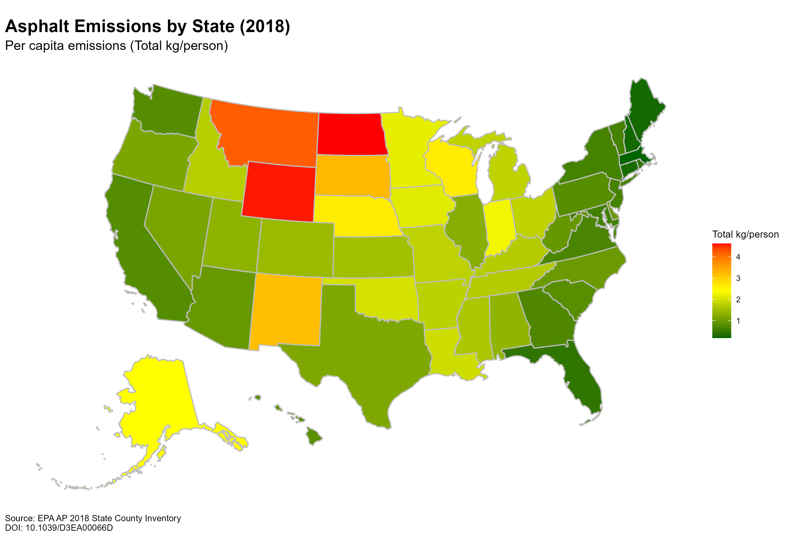

# Asphalt Emissions Choropleth Map (2018)

This project visualizes U.S. state-level asphalt emissions data from 2018.

## Map Preview

## Data Source
**Anthropogenic secondary organic aerosol and ozone production from asphalt-related emissions**  
*Environ. Sci.: Atmos.*, 2023, 3, 1221-1230  
DOI: [10.1039/D3EA00066D](https://doi.org/10.1039/D3EA00066D)

Data File: `AP_2018_State_County_Inventory.xlsx` (Source: EPA/Pasteur)

## Project Structure
*   **`script.R`**: Main R script to download data, process it, and generate the map.
*   **`data/`**: Contains the input Excel file (downloaded automatically).
*   **`plots/`**: Contains the output PNG map.
*   **`plan.md`**: Implementation plan.
*   **`prompt.md`**: Generative AI prompt used to create the outputs.
*   **`tasks.md`**: Detailed task checklist.
*   **`walkthrough.md`**: Step-by-step guide to the project.
*   **`.gitignore`**: Git ignore file.

## Documentation
*   [Generative AI Prompt](prompt.md)
*   [Implementation Plan](plan.md)
*   [Task Checklist](tasks.md)
*   [Walkthrough](walkthrough.md)

## Colophon
This project was created using the [Gemini 3 (Pro)](https://gemini.ai/) generative AI model via [Google Antigravity](https://antigravity.google/) on 2025-12-12. The agentic workflow took 3 minutes to complete. The only manual edits were to the `README.md` file to add this colophon and references to the `prompt.md` file.